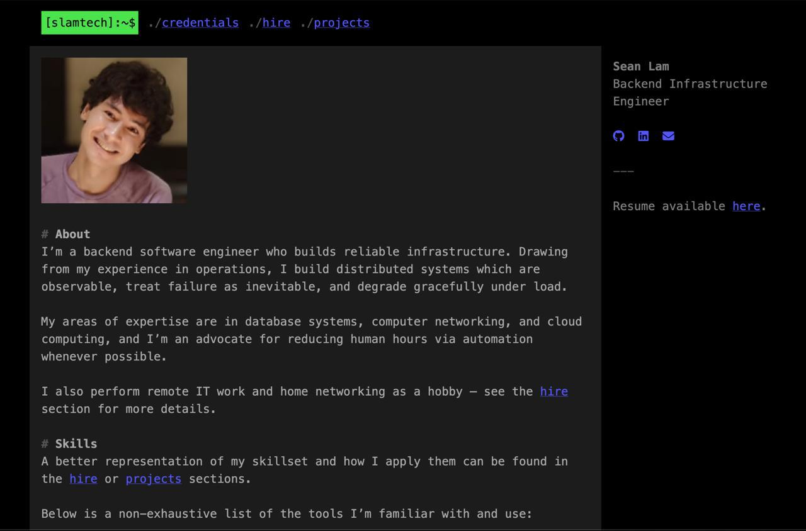

# OzuYatamutsu/online-portfolio
[](https://github.com/OzuYatamutsu/online-portfolio/actions/workflows/build-and-deploy.yaml)

It's my professional portfolio! (Built with [hugo](https://github.com/gohugoio/hugo) and the [risotto](https://github.com/joeroe/risotto) theme)

## Building
Install hugo:
```sh
brew install hugo
```

Build HTML/CSS:
```sh
hugo
```

TODO

## Testing
With hugo installed, run the development server:
```sh
hugo serve -D
```

## Adding new content
```sh
hugo new content content/.../NEW_PAGE_NAME.md
```

A new Markdown file will be created at the specified path. Edit it and it will be included in the next build.

## Deployment
Merges to `main` automatically trigger a build and deploy of all content in the repository.

TODO
